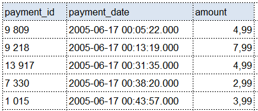

Домашнее задание по теме "Работа с базами данных"

Задание

Преподаватель: Николай Хащанов, Игорь Крамер

Все работы мы проверяем на антиплагиат, поэтому важно выполнять их самостоятельно. Работам, которые не пройдут проверку, преподаватель поставит незачёт. Если вы сталкиваетесь со сложностями, задавайте вопросы нашим экспертам и аспирантам, они с удовольствием вам помогут. Успехов в решении заданий!

Модуль 2. Домашнее задание по теме «Работа с базами данных»

Цели домашнего задания:

научиться явно указывать колонки в SELECT и задавать названия колонкам;
закрепить навыки фильтрации и сортировки строк в таблицах с использованием основных операторов языка SQL;
научиться выполнять преобразования текстовых, числовых значений и дат с помощью функций языка SQL по работе со строками, датами и числами.
Основная часть:

Задание 1. Выведите уникальные названия городов из таблицы городов.
Ожидаемый результат запроса: 

Задание 2. Доработайте запрос из предыдущего задания, чтобы запрос выводил только те города, названия которых начинаются на “L” и заканчиваются на “a”, и названия не содержат пробелов.
Ожидаемый результат запроса: 

Задание 3. Получите из таблицы платежей за прокат фильмов информацию по платежам, которые выполнялись в промежуток с 17 июня 2005 года по 19 июня 2005 года включительно и стоимость которых превышает 1.00. Платежи нужно отсортировать по дате платежа.
Ожидаемый результат запроса: 

Задание 4. Выведите информацию о 10-ти последних платежах за прокат фильмов.
Ожидаемый результат запроса: 

Задание 5. Выведите следующую информацию по покупателям:

Фамилия и имя (в одной колонке через пробел)
Электронная почта
Длину значения поля email
Дату последнего обновления записи о покупателе (без времени)
Каждой колонке задайте наименование на русском языке.
Ожидаемый результат запроса: 
Задание 6. Выведите одним запросом только активных покупателей, имена которых KELLY или WILLIE. Все буквы в фамилии и имени из верхнего регистра должны быть переведены в нижний регистр.
Ожидаемый результат запроса: 

Дополнительная часть:

Задание 1.Выведите информацию о фильмах, у которых рейтинг “R” и стоимость аренды указана от 0.00 до 3.00 включительно, а также фильмы c рейтингом “PG-13” и стоимостью аренды больше или равной 4.00.
Ожидаемый результат запроса: 

Задание 2. Получите информацию о трёх фильмах с самым длинным описанием фильма.
Ожидаемый результат запроса: 

Задание 3. Выведите Email каждого покупателя, разделив значение Email на 2 отдельных колонки:

в первой колонке должно быть значение, указанное до @,
во второй колонке должно быть значение, указанное после @.
Ожидаемый результат запроса: 
Задание 4. Доработайте запрос из предыдущего задания, скорректируйте значения в новых колонках: первая буква строки должна быть заглавной, остальные строчными.
Ожидаемый результат запроса: 

Результат домашнего задания
Заполните ответами шаблон для сдачи ДЗ в формате sql.

Критерии оценки
Для получения зачета по домашнему заданию необходимо правильно выполнить все задания из основной части.

Преподаватель вправе предложить дополнительные задачи в рамках задания, чтобы подтвердить, что студент разобрался в теме.
Преподаватель вправе поставить незачет без права пересдачи текущего задания, если студент прислал на проверку результат чужой работы и отказался делать дополнительное задание.
